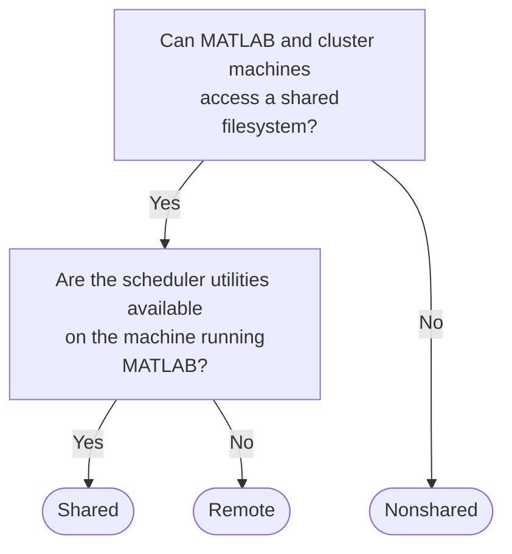

# Parallel Computing Toolbox plugin for MATLAB Parallel Server with Slurm

[](https://www.mathworks.com/matlabcentral/fileexchange/52807)

Parallel Computing Toolbox&trade; provides the `Generic` cluster type for submitting MATLAB&reg; jobs to a cluster running a third-party scheduler.
`Generic` uses a set of plugin scripts to define how your machine running MATLAB or Simulink&reg; communicates with your scheduler.
You can customize the plugin scripts to configure how MATLAB interacts with the scheduler to best suit your cluster's setup and to support custom submission options.

This repository contains MATLAB code files and shell scripts that you can use to submit jobs from a MATLAB or Simulink session running on Windows&reg;, Linux&reg;, or macOS to a Slurm&reg; scheduler running on Linux.

## Products Required

- [MATLAB](https://mathworks.com/products/matlab.html) and [Parallel Computing Toolbox](https://mathworks.com/products/parallel-computing.html), release R2017a or newer, installed on your computer.
Refer to the documentation for [how to install MATLAB and toolboxes](https://mathworks.com/help/install/index.html) on your computer.
- [MATLAB Parallel Server&trade;](https://mathworks.com/products/matlab-parallel-server.html) installed on the cluster.
Refer to the documentation for [how to install MATLAB Parallel Server](https://mathworks.com/help/matlab-parallel-server/integrate-matlab-with-third-party-schedulers.html) on your cluster.
The cluster administrator normally does this step.
- [Slurm](https://slurm.schedmd.com/) running on the cluster.

## Which Plugin Scripts Should I Use?

This repository provides a set of plugin scripts in each of the `shared`, `remote`, and `nonshared` folders.
Each folder corresponds to a **submission mode**, determining how MATLAB submits jobs to the scheduler and retrieves the results.
Use this section to determine which submission mode is appropriate for your network setup.

To decide which submission mode to use, consult the following diagram.



### Shared Submission Mode

MATLAB uses files on disk to send tasks to the Parallel Server workers and fetch their results back.
This is most effective when there is a disk location accessible to both your machine running MATLAB and the workers on the cluster.
Your computer can communicate with the workers by reading and writing to this shared filesystem.

To manage work on the cluster, MATLAB calls the Slurm command line utilities.
For example, the `sbatch` command is used to submit work and `sacct` to query the state of submitted jobs.
If your MATLAB session is running on a machine with the scheduler utilities available, the plugin scripts can call the utilities on the command line.
This is typically true if your MATLAB session is running on the same Slurm cluster you want to submit to.

If your MATLAB session and workers have a shared filesystem and the scheduler utilities are available on your machine, use **shared submission mode**.

### Remote Submission Mode

If MATLAB cannot directly access the scheduler utilities on the command line, but can access the same filesystem as the workers, use **remote submission mode**.
MATLAB creates an SSH session to the cluster and runs scheduler commands over that connection.
Job files are still shared between your MATLAB session and the workers using the shared filesystem.

This submission mode is useful for submitting from a MATLAB session on a Windows computer to a Linux Slurm cluster on the same network.
Your Windows machine creates an SSH session to the cluster head node to access the Slurm utilities, while using a shared networked folder to store job data files.

If your MATLAB session is running on a compute node of the cluster where you want to submit work to, you can use remote submission mode to create an SSH session to the cluster's head node to submit more jobs.

### Nonshared Submission Mode

If there isn't a shared filesystem, you need to use **nonshared submission mode**.
In this mode, MATLAB uses SSH to submit commands to the scheduler and SFTP to copy job and task files between your computer and the cluster.

Note that transferring large data files (e.g. hundreds of MB) over the SFTP connection can cause a noticeable overhead to job submission and fetching results, so it is best to use a shared filesystem with remote submission mode if one is available.
There must be a shared filesystem location available to all the workers, even if your computer cannot access it.

## Setup Instructions

Before proceeding, ensure that the above required products are installed.

### Download or Clone this Repository

To download a zip file of this repository, at the top of this repository page, select **Code > Download ZIP**.
Alternatively, to clone this repository to your computer with git installed, run the following command on your operating system's command line:
```
git clone https://github.com/mathworks/matlab-parallel-slurm-plugin
```
You can execute a system command from the MATLAB command line by adding a `!` before the command.

### Create a Cluster Profile in MATLAB

You can create a cluster profile by using either the Cluster Profile Manager or the MATLAB command line.

To open the Cluster Profile Manager, on the **Home** tab, in the **Environment** section, select **Parallel > Create and Manage Clusters**.
Within the Cluster Profile Manager, select **Add Cluster Profile > Generic** from the menu to create a new `Generic` cluster profile.

Alternatively, for a command line workflow without using graphical user interfaces, create a new `Generic` cluster object by running:
```matlab
c = parallel.cluster.Generic;
```

### Configure Cluster Properties

The table below gives the minimum properties required for `Generic` to work correctly.
For a full list of cluster properties, see the documentation for [`parallel.Cluster`](https://mathworks.com/help/parallel-computing/parallel.cluster.html).

**Property**          | **Description**
----------------------|----------------
JobStorageLocation    | Where job data is stored by your machine.
NumWorkers            | Number of workers your license allows.
ClusterMatlabRoot     | Full path to the MATLAB install folder on the cluster.
OperatingSystem       | The cluster's operating system.
HasSharedFilesystem   | True for shared and remote submission modes, false for nonshared.
PluginScriptsLocation | Full path to the shared, remote or nonshared folder, depending on your submission mode. If using R2019a or earlier, this property is called IntegrationScriptsLocation.

In the Cluster Profile Manager, set each property value in the boxes provided.
Alternatively, at the command line, set each property on the cluster object using dot notation:
```matlab
c.JobStorageLocation = 'C:\MatlabJobs';
% etc.
```

At the command line, you can also set properties at the same time you create the `Generic` cluster object, by specifying name-value pairs in the constructor:
```matlab
c = parallel.cluster.Generic( ...
    'JobStorageLocation', 'C:\MatlabJobs', ...
    'NumWorkers', 20, ...
    'ClusterMatlabRoot', '/usr/local/MATLAB/R2022a', ...
    'OperatingSystem', 'unix', ...
    'HasSharedFilesystem', true, ...
    'PluginScriptsLocation', 'C:\MatlabSlurmPlugin\shared');
```

If you're submitting from a Windows machine to a Linux cluster in remote submission mode, you can specify the `JobStorageLocation` as a structure specifying how to find the shared folder on each operating system.
For example:
```matlab
struct('windows', '\\organization\matlabjobs\jobstorage', 'unix', '/organization/matlabjobs/jobstorage')
```
or if you have the drive letter `M:` mapped to `\\organization\matlabjobs`:
```matlab
struct('windows', 'M:\jobstorage', 'unix', '/organization/matlabjobs/jobstorage')
```

### Configure AdditionalProperties

You can use `AdditionalProperties` as a way of modifying the behaviour of `Generic` without having to edit the plugin scripts.
For a full list of the `AdditionalProperties` supported by the plugin scripts in this repository, see [Customize Behavior of Sample Plugin Scripts](https://mathworks.com/help/matlab-parallel-server/customize-behavior-of-sample-plugin-scripts.html).
By modifying the plugins, you can add support for your own custom `AdditionalProperties`.

In shared submission mode, you do not need to set any `AdditionalProperties` to use these plugins.

In both remote and nonshared submission modes, set `ClusterHost` to the name of the machine MATLAB should SSH to.
This is the machine on which MATLAB runs scheduler utilities such as `sbatch` and `squeue`, so typically select the cluster head node or login node.

In nonshared mode only, set `RemoteJobStorageLocation` to a folder available on the cluster for the workers to write results to.
MATLAB uses SFTP to copy files to and from this folder.

In the Cluster Profile Manager, add new `AdditionalProperties` by clicking **Add** under the table of `AdditionalProperties`.
On the command line, use dot notation to add new fields:
```matlab
c.AdditionalProperties.ClusterHost = 'slurm01.organization.com'; % MATLAB will SSH to slurm01 to submit jobs
```

### Save Your New Profile

In the Cluster Profile Manager, click **Done**.
On the command line, run:
```matlab
saveAsProfile(c, "mySlurmCluster");
```
Your cluster profile is now ready to use.

### Validate the Cluster Profile

Cluster validation submits one of each type of job to test the cluster profile has been configured correctly.
In the Cluster Profile Manager, click the **Validate** button.
If you make a change to a cluster profile, you can rerun cluster validation to ensure there are no errors.
You do not need to validate each time you use the profile or each time you start MATLAB.

## Examples

First create a cluster object using your profile:
```matlab
c = parcluster("mySlurmCluster")
```

### Submit Work for Batch Processing

The `batch` command runs a MATLAB script or function on a worker on the cluster.
For more information about batch processing, see the documentation for the [batch command](https://mathworks.com/help/parallel-computing/batch.html).

```matlab
% Create and submit a job to the cluster
job = batch( ...
    c, ... % cluster object created using parcluster
    @sqrt, ... % function/script to run
    1, ... % number of output arguments
    {[64 100]}); % input arguments

% Your MATLAB session is now available to do other work, such
% as create and submit more jobs to the cluster. You can also
% shut down your MATLAB session and come back later - the work
% will continue running on the cluster. Once you've recreated
% the cluster object using parcluster, you can view existing
% jobs using the Jobs property on the cluster object.

% Wait for the job to complete. If the job is already complete,
% this will return immediately.
wait(job);

% Retrieve the output arguments for each task. For this example,
% results will be a 1x1 cell array containing the vector [8 10].
results = fetchOutputs(job)
```

### Open a Parallel Pool

A parallel pool (parpool) is a group of MATLAB workers that you can interactively run work on.
When you run the `parpool` command, MATLAB will submit a special job to the cluster to start the workers.
Once the workers have started, your MATLAB session will connect to them.
Depending on the network configuration at your organization, including whether it is permissible to connect to a program running on a compute node, parpools may not be functional in nonshared submission mode.
For more information about parpools, see the documentation for the [parpool command](https://mathworks.com/help/parallel-computing/parpool.html).

```matlab
% Open a parallel pool on the cluster. This command will return
% once the pool is opened.
pool = parpool(c);

% List the hosts the workers are running on. For a small pool,
% all the workers will likely be on the same machine. For a large
% pool, the workers will be spread over multiple nodes.
future = parfevalOnAll(pool, @getenv, 1, 'HOST')
wait(future);
fetchOutputs(future)

% Output the numbers 1 to 10 in a parallel for (parfor) loop.
% Unlike a regular for loop, iterations of the loop will not
% be executed in order.
parfor idx = 1:10
    disp(idx)
end

% Use the pool to calculate the first 500 magic squares.
parfor idx = 1:500
    magicSquare{idx} = magic(idx);
end
```

## License

The license is available in the [license.txt](license.txt) file in this repository.

## Community Support

[MATLAB Central](https://www.mathworks.com/matlabcentral)

## Technical Support

If you require assistance or have a request for additional features or capabilities, please contact [MathWorks Technical Support](https://www.mathworks.com/support/contact_us.html).

Copyright 2022 The MathWorks, Inc.
